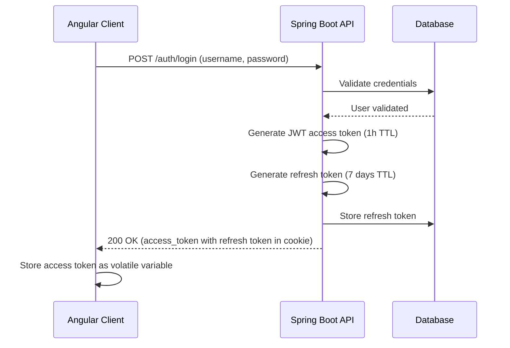
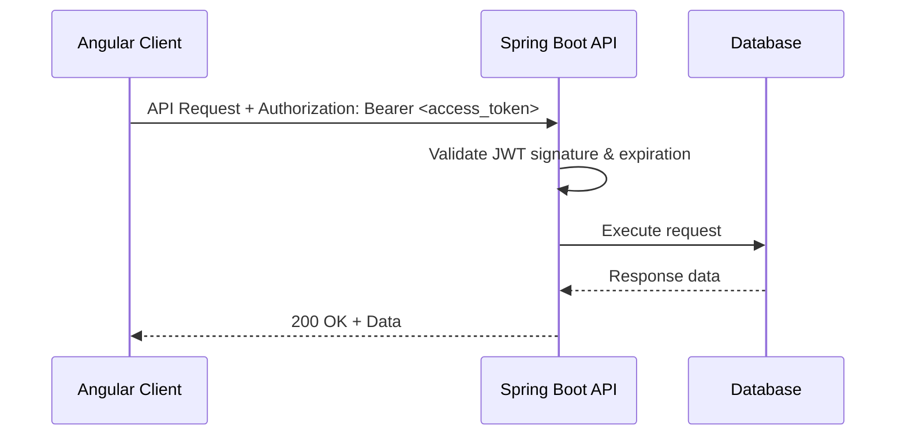
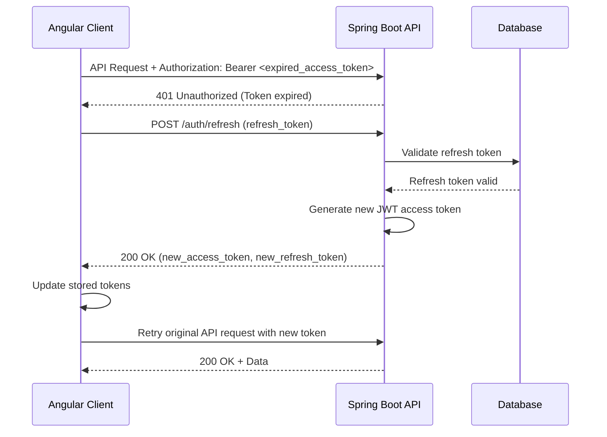
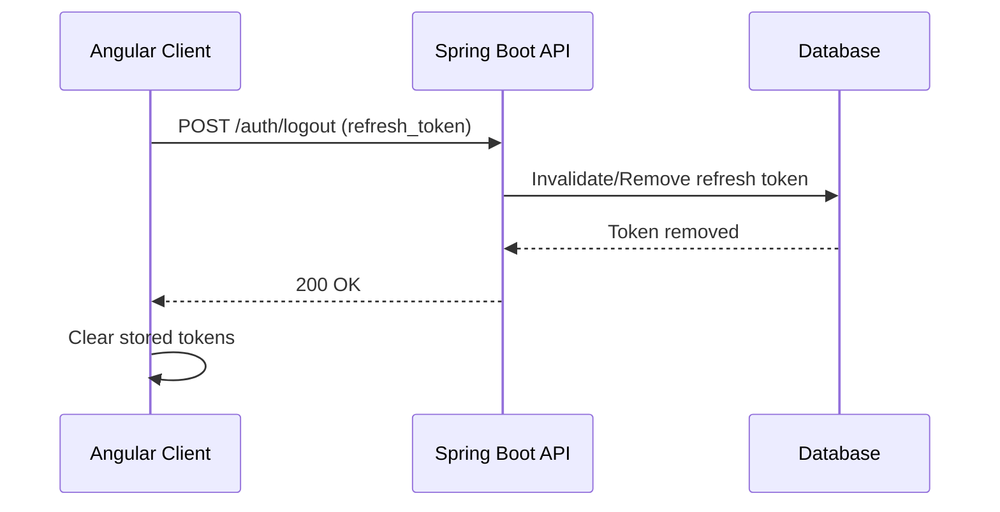

# App starter

[](https://github.com/vmillet-dev/tripr-app/actions)
[](https://github.com/vmillet-dev/tripr-app/actions)

A production-ready full-stack starter project featuring JWT authentication with refresh tokens, built with modern technologies and best practices.

## Table of Contents

- [Project Overview](#project-overview)
- [Getting Started](#getting-started)
- [Documentation Navigation](#documentation-navigation)

## Project Overview

### Purpose

This project is a **production-ready starter project** designed to be a starter project for future ideas over full-stack web application development. It showcases modern authentication patterns with **JWT access tokens and refresh tokens**, providing a secure foundation for building scalable web applications.

**Key Benefits:**
- 🔐 **Secure Authentication** - JWT with refresh token implementation
- 🏗️ **Modern Architecture** - Hexagonal architecture with clean separation of concerns  
- 🚀 **Production Ready** - Comprehensive CI/CD, monitoring, and deployment automation
- 📱 **Responsive Design** - Mobile-first Angular frontend with Bootstrap
- 🌍 **Internationalization** - Multi-language support (English/French)
- 🧪 **Comprehensive Testing** - Unit, integration, and E2E test coverage

### Technology Stack

#### Frontend

| Technology    | Version | Purpose                                         |
|---------------|---------|-------------------------------------------------|
| **Angular**   | 19.2.0  | Modern web framework with standalone components |
| **Bootstrap** | 5.3.5   | Responsive CSS framework                        |

#### Backend

| Technology      | Version | Purpose                   |
|-----------------|---------|---------------------------|
| **Spring Boot** | 3.5.0   | Enterprise Java framework |
| **Kotlin**      | 2.2.0   | Modern JVM language       |
| **Java**        | 24      | Runtime platform          |
| **Gradle**      | 8.14    | Build automation          |

#### DevOps & Infrastructure

| Technology  | Version | Purpose                   |
|-------------|---------|---------------------------|
| **Docker**  | 20.10+  | Containerization          |
| **Ansible** | 2.18.6  | Infrastructure automation |
| **Cypress** | 13.0+   | End-to-end testing        |

### Project Structure

This monorepo is organized into focused modules with clear responsibilities:

```
tripr-app/
├── backend/                    # Spring Boot backend application
│   ├── bootstrap/              # Application entry point and configuration
│   ├── domain/                 # Core business logic and entities
│   ├── application/            # Use cases and application services
│   └── infrastructure/         # External integrations and adapters
├── frontend/                   # Angular frontend application
│   ├── src/app/core/           # Singleton services and guards
│   ├── src/app/features/       # Feature modules (auth, dashboard)
│   └── src/assets/i18n/        # Translation files
├── devops/                     # Infrastructure as Code
│   ├── ansible/                # Deployment automation
│   ├── Dockerfile              # Multi-stage container build
│   └── compose-*.yaml          # Docker Compose configurations
├── e2e/                        # End-to-end testing suite
│   └── cypress/                # Cypress test specifications
└── .github/workflows/          # CI/CD pipeline definitions
``` 

## Getting Started

### Prerequisites

Ensure you have the following tools installed with the specified minimum versions:

| Tool        | Version | Installation                                          | Verification       |
|-------------|---------|-------------------------------------------------------|--------------------|
| **Java**    | 24+     | [Download JDK](https://adoptium.net/)                 | `java --version`   |
| **Node.js** | 22+     | [Download Node.js](https://nodejs.org/)               | `node --version`   |
| **Docker**  | 20.10+  | [Install Docker](https://docs.docker.com/get-docker/) | `docker --version` |
| **Git**     | 2.30+   | [Install Git](https://git-scm.com/downloads)          | `git --version`    |

### Quick Start

Follow these steps to get the entire application running locally:

#### 1. Clone the Repository

```bash
git clone https://github.com/vmillet-dev/tripr-app.git
cd tripr-app
```

#### 2. Start Backend Application

Build and run the Spring Boot application (spring docker compose will start automatically the dev environment
from devops/compose-dev.yaml file)

```bash
cd backend
./gradlew bootRun
# ./gradlew.bat bootRun for windows
```

**Expected output:**
```
> Task :bootstrap:bootRun

  .   ____          _            __ _ _
 /\\ / ___'_ __ _ _(_)_ __  __ _ \ \ \ \
( ( )\___ | '_ | '_| | '_ \/ _` | \ \ \ \
 \\/  ___)| |_)| | | | | || (_| |  ) ) ) )
  '  |____| .__|_| |_|_| |_\__, | / / / /
 =========|_|==============|___/=/_/_/_/
 :: Spring Boot ::                (v3.5.0)

2024-01-15 10:30:00.000  INFO --- [           main] com.adsearch.Application                 : Started Application in 3.456 seconds
2024-01-15 10:30:00.000  INFO --- [           main] com.adsearch.Application                 : Application is running on http://localhost:8081
```

#### 3. Start Frontend Application

```bash
cd frontend
# Install dependencies
npm install
# Start the Angular development server
npm start
```

**Expected output:**
```
✅ Local:   http://localhost:4200/
✅ press h + enter to show help

✅ Application bundle generation complete.
✅ watch mode enabled. watching for file changes...
```

#### 4. Access the Application

- **Frontend**: http://localhost:4200
- **Backend API**: http://localhost:8081/api
- **API Documentation**: http://localhost:8081/swagger-ui.html
- **Email Testing (Mailpit)**: http://localhost:8026
- **Database**: localhost:5433 (postgres/P4ssword!)

### Testing During Development

**Run All Tests:**
```bash
# Backend tests (unit + integration)
cd backend && ./gradlew test

# Frontend tests (unit)
cd frontend && npm test

# E2E tests (full application)
cd e2e && npm run cypress:run
```

## Authentication Flow

### Initial Login Process



### API Request with Valid Token



### Token Refresh Process



### Logout Process



## Documentation Navigation

Each component has detailed documentation with setup instructions, architecture explanations, and troubleshooting guides:

### Component Documentation

| Component                          | Description                                              | Key Topics                                   |
|------------------------------------|----------------------------------------------------------|----------------------------------------------|
| **[Backend](backend/README.md)**   | Spring Boot + Kotlin backend with hexagonal architecture | JWT auth, database setup, testing, API docs  |
| **[Frontend](frontend/README.md)** | Angular 19 frontend with JWT token management            | Components, services, routing, i18n          |
| **[E2E Testing](e2e/README.md)**   | Cypress end-to-end testing suite                         | Test structure, page objects, CI integration |
