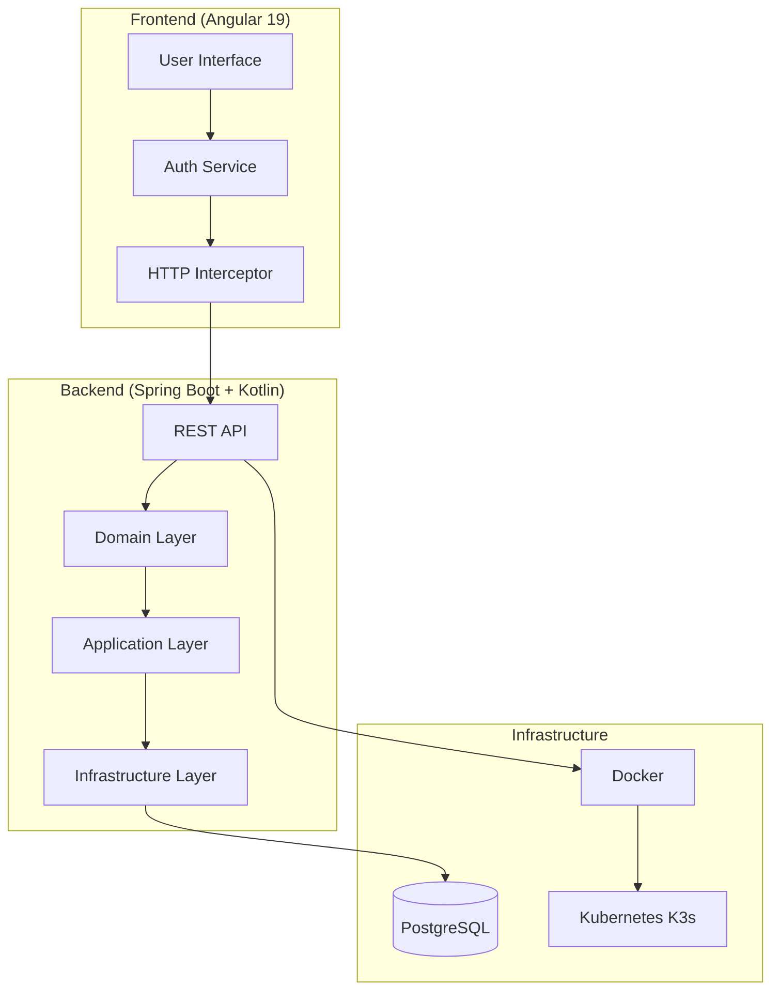

# Tripr App

[](https://github.com/vmillet-dev/tripr-app/actions)
[](https://github.com/vmillet-dev/tripr-app/actions)
[](https://opensource.org/licenses/MIT)

A production-ready full-stack starter project featuring JWT authentication with refresh tokens, built with modern technologies and best practices.

## Table of Contents

- [Project Overview](#project-overview)
- [Getting Started](#getting-started)
- [Documentation Navigation](#documentation-navigation)
- [Troubleshooting](#troubleshooting)
- [Contributing](#contributing)
- [License](#license)

## Project Overview

### Purpose

Tripr App is a **production-ready starter project** designed to accelerate full-stack web application development. It showcases modern authentication patterns with **JWT access tokens and refresh tokens**, providing a secure foundation for building scalable web applications.

**Key Benefits:**
- 🔐 **Secure Authentication** - JWT with refresh token implementation
- 🏗️ **Modern Architecture** - Hexagonal architecture with clean separation of concerns  
- 🚀 **Production Ready** - Comprehensive CI/CD, monitoring, and deployment automation
- 📱 **Responsive Design** - Mobile-first Angular frontend with Bootstrap
- 🌍 **Internationalization** - Multi-language support (English/French)
- 🧪 **Comprehensive Testing** - Unit, integration, and E2E test coverage

### Architecture

The application follows a **microservices-ready monolithic architecture** with clear separation between frontend and backend:



**Authentication Flow:**
1. **Login** - User credentials exchanged for JWT access token + HTTP-only refresh cookie
2. **API Requests** - Access token sent in Authorization header
3. **Token Refresh** - Automatic renewal using refresh cookie when access token expires
4. **Logout** - Tokens invalidated and cookies cleared

### Technology Stack

#### Frontend
| Technology | Version | Purpose |
|------------|---------|---------|
| **Angular** | 19.2.0 | Modern web framework with standalone components |
| **TypeScript** | 5.7.2 | Type-safe JavaScript development |
| **Bootstrap** | 5.3.5 | Responsive CSS framework |
| **RxJS** | 7.8.0 | Reactive programming for async operations |
| **Transloco** | 7.5.0 | Internationalization (i18n) |

#### Backend
| Technology | Version | Purpose |
|------------|---------|---------|
| **Spring Boot** | 3.5.0 | Enterprise Java framework |
| **Kotlin** | 2.2.0 | Modern JVM language |
| **Java** | 24 | Runtime platform |
| **PostgreSQL** | 17.3 | Relational database |
| **Gradle** | 8.14 | Build automation |
| **MapStruct** | 1.6.3 | Object mapping |

#### DevOps & Infrastructure
| Technology | Version | Purpose |
|------------|---------|---------|
| **Docker** | 20.10+ | Containerization |
| **Kubernetes (K3s)** | Latest | Container orchestration |
| **Ansible** | 2.18.6 | Infrastructure automation |
| **GitHub Actions** | - | CI/CD pipeline |
| **Cypress** | 13.0+ | End-to-end testing |

### Project Structure

This monorepo is organized into focused modules with clear responsibilities:

```
tripr-app/
├── backend/                    # Spring Boot backend application
│   ├── bootstrap/              # Application entry point and configuration
│   ├── domain/                 # Core business logic and entities
│   ├── application/            # Use cases and application services
│   └── infrastructure/         # External integrations and adapters
├── frontend/                   # Angular frontend application
│   ├── src/app/core/          # Singleton services and guards
│   ├── src/app/features/      # Feature modules (auth, dashboard)
│   └── src/assets/i18n/       # Translation files
├── devops/                     # Infrastructure as Code
│   ├── ansible/               # Deployment automation
│   ├── Dockerfile             # Multi-stage container build
│   └── compose-*.yaml         # Docker Compose configurations
├── e2e/                       # End-to-end testing suite
│   └── cypress/               # Cypress test specifications
└── .github/workflows/         # CI/CD pipeline definitions
```

**Module Responsibilities:**
- **Backend** - REST API, business logic, data persistence, authentication
- **Frontend** - User interface, client-side routing, state management
- **DevOps** - Containerization, orchestration, deployment automation
- **E2E** - Integration testing, user journey validation

## Getting Started

### Prerequisites

Ensure you have the following tools installed with the specified minimum versions:

| Tool | Version | Installation | Verification |
|------|---------|--------------|--------------|
| **Java** | 24+ | [Download JDK](https://adoptium.net/) | `java --version` |
| **Node.js** | 22+ | [Download Node.js](https://nodejs.org/) | `node --version` |
| **Docker** | 20.10+ | [Install Docker](https://docs.docker.com/get-docker/) | `docker --version` |
| **Docker Compose** | 2.0+ | [Install Compose](https://docs.docker.com/compose/install/) | `docker compose version` |
| **Git** | 2.30+ | [Install Git](https://git-scm.com/downloads) | `git --version` |

**Optional but Recommended:**
- **Angular CLI** - `npm install -g @angular/cli@19`
- **Gradle** - Included via wrapper (`./gradlew`)

### Quick Start

Follow these steps to get the entire application running locally:

#### 1. Clone the Repository

```bash
git clone https://github.com/vmillet-dev/tripr-app.git
cd tripr-app
```

#### 2. Start Infrastructure Services

```bash
# Start PostgreSQL and Mailpit using Docker Compose
docker compose -f devops/compose-dev.yaml up -d

# Verify services are running
docker compose -f devops/compose-dev.yaml ps
```

**Expected output:**
```
NAME                     IMAGE               STATUS
devops-postgres-1        postgres:17.3       Up 30 seconds
devops-mailpit-1         axllent/mailpit     Up 30 seconds
```

#### 3. Start Backend Application

```bash
cd backend

# Build and run the Spring Boot application
./gradlew bootRun
```

**Expected output:**
```
> Task :bootstrap:bootRun

  .   ____          _            __ _ _
 /\\ / ___'_ __ _ _(_)_ __  __ _ \ \ \ \
( ( )\___ | '_ | '_| | '_ \/ _` | \ \ \ \
 \\/  ___)| |_)| | | | | || (_| |  ) ) ) )
  '  |____| .__|_| |_|_| |_\__, | / / / /
 =========|_|==============|___/=/_/_/_/
 :: Spring Boot ::                (v3.5.0)

2024-01-15 10:30:00.000  INFO --- [           main] com.adsearch.Application                 : Started Application in 3.456 seconds
2024-01-15 10:30:00.000  INFO --- [           main] com.adsearch.Application                 : Application is running on http://localhost:8081
```

#### 4. Start Frontend Application

```bash
# Open a new terminal window
cd frontend

# Install dependencies
npm install

# Start the Angular development server
npm start
```

**Expected output:**
```
✅ Local:   http://localhost:4200/
✅ press h + enter to show help

✅ Application bundle generation complete.
✅ watch mode enabled. watching for file changes...
```

#### 5. Access the Application

- **Frontend**: http://localhost:4200
- **Backend API**: http://localhost:8081/api
- **API Documentation**: http://localhost:8081/swagger-ui.html
- **Email Testing (Mailpit)**: http://localhost:8026
- **Database**: localhost:5433 (postgres/P4ssword!)

### Environment Setup

#### Environment Variables

Create a `.env` file in the project root (optional for development):

```bash
# Database Configuration
DB_HOST=localhost
DB_PORT=5433
DB_NAME=tripr
DB_USERNAME=postgres
DB_PASSWORD=P4ssword!

# JWT Configuration (development only - not secure)
JWT_SECRET=development-secret-key-not-for-production-use-only
BASE_URL=http://localhost:8081

# Email Configuration (Mailpit)
MAIL_HOST=localhost
MAIL_PORT=1026
MAIL_USERNAME=
MAIL_PASSWORD=

# Spring Profile
SPRING_PROFILES_ACTIVE=dev
```

#### Configuration Files

**Backend Configuration** (`backend/bootstrap/src/main/resources/application.yml`):
```yaml
spring:
  profiles:
    active: dev
  datasource:
    url: jdbc:postgresql://${DB_HOST:localhost}:${DB_PORT:5433}/${DB_NAME:tripr}
    username: ${DB_USERNAME:postgres}
    password: ${DB_PASSWORD:P4ssword!}
  jpa:
    hibernate:
      ddl-auto: update
    show-sql: false

jwt:
  secret: ${JWT_SECRET:development-secret-key-not-for-production-use-only}
  expiration: 3600000  # 1 hour
  refresh-expiration: 604800000  # 7 days

app:
  base-url: ${BASE_URL:http://localhost:8081}
```

**Frontend Configuration** (`frontend/src/environments/environment.ts`):
```typescript
export const environment = {
  production: false,
  apiUrl: 'http://localhost:8081/api',
  baseUrl: 'http://localhost:4200'
};
```

### Development Workflow

#### Typical Development Process

1. **Start Infrastructure** - `docker compose -f devops/compose-dev.yaml up -d`
2. **Backend Development** - `cd backend && ./gradlew bootRun`
3. **Frontend Development** - `cd frontend && npm start`
4. **Make Changes** - Edit code with hot reload enabled
5. **Run Tests** - `./gradlew test` (backend) and `npm test` (frontend)
6. **Commit Changes** - Follow conventional commit format
7. **Create Pull Request** - Automated CI/CD will run tests

#### Hot Reload Development

Both frontend and backend support hot reload for efficient development:

**Backend Hot Reload:**
```bash
# Enable Spring Boot DevTools (already configured)
cd backend
./gradlew bootRun

# Changes to Kotlin files will trigger automatic restart
```

**Frontend Hot Reload:**
```bash
# Angular CLI automatically reloads on file changes
cd frontend
npm start

# Changes to TypeScript/HTML/CSS files reload instantly
```

#### Testing During Development

**Run All Tests:**
```bash
# Backend tests (unit + integration)
cd backend && ./gradlew test

# Frontend tests (unit)
cd frontend && npm test

# E2E tests (full application)
cd e2e && npm run cypress:run
```

**Test Coverage:**
```bash
# Backend coverage report
cd backend && ./gradlew jacocoTestReport
open backend/build/reports/jacoco/test/html/index.html

# Frontend coverage report
cd frontend && npm run test:coverage
open frontend/coverage/index.html
```

## Documentation Navigation

Each component has detailed documentation with setup instructions, architecture explanations, and troubleshooting guides:

### Component Documentation

| Component | Description | Key Topics |
|-----------|-------------|------------|
| **[Backend](backend/README.md)** | Spring Boot + Kotlin backend with hexagonal architecture | JWT auth, database setup, testing, API docs |
| **[Frontend](frontend/README.md)** | Angular 19 frontend with JWT token management | Components, services, routing, i18n |
| **[DevOps](devops/README.md)** | Docker, Kubernetes, and Ansible infrastructure | Containerization, K3s deployment, CI/CD |
| **[E2E Testing](e2e/README.md)** | Cypress end-to-end testing suite | Test structure, page objects, CI integration |

### Quick Reference Links

**Development:**
- [Backend API Documentation](http://localhost:8081/swagger-ui.html) - Interactive API explorer
- [Frontend Development Server](http://localhost:4200) - Angular application
- [Email Testing Interface](http://localhost:8026) - Mailpit web UI

**Architecture & Design:**
- [Hexagonal Architecture](backend/README.md#project-structure) - Backend architecture patterns
- [JWT Authentication Flow](backend/README.md#authentication) - Security implementation
- [Angular Component Structure](frontend/README.md#project-structure) - Frontend organization

**Deployment & Operations:**
- [Docker Build Process](devops/README.md#docker-setup) - Multi-stage containerization
- [Kubernetes Deployment](devops/README.md#kubernetes-deployment) - K3s orchestration
- [CI/CD Pipeline](devops/README.md#cicd-pipeline) - GitHub Actions workflows

## Troubleshooting

### Common Setup Issues

#### Database Connection Problems

**Problem**: Backend fails to connect to PostgreSQL

**Solution**:
```bash
# Check if PostgreSQL container is running
docker compose -f devops/compose-dev.yaml ps

# Verify database connectivity
docker compose -f devops/compose-dev.yaml exec postgres psql -U postgres -d tripr -c "SELECT 1;"

# Check backend logs for connection errors
cd backend && ./gradlew bootRun --debug
```

#### Port Conflicts

**Problem**: "Port already in use" errors

**Solution**:
```bash
# Check which processes are using ports
lsof -i :4200  # Frontend
lsof -i :8081  # Backend
lsof -i :5433  # PostgreSQL

# Kill processes if needed
kill -9 <PID>

# Or use different ports in configuration
```

#### Node.js/npm Issues

**Problem**: Frontend dependencies fail to install

**Solution**:
```bash
# Clear npm cache
npm cache clean --force

# Delete node_modules and reinstall
cd frontend
rm -rf node_modules package-lock.json
npm install

# Use specific Node.js version
nvm use 22
npm install
```

#### Java/Gradle Issues

**Problem**: Backend build fails with Java version errors

**Solution**:
```bash
# Check Java version
java --version  # Should be 24+

# Use JAVA_HOME if needed
export JAVA_HOME=/path/to/java24
cd backend && ./gradlew bootRun

# Clean and rebuild
./gradlew clean build
```

### Performance Issues

#### Slow Application Startup

**Problem**: Backend takes too long to start

**Solution**:
```bash
# Check available memory
free -h

# Increase JVM heap size
export JAVA_OPTS="-Xmx2g -Xms1g"
cd backend && ./gradlew bootRun

# Use development profile for faster startup
export SPRING_PROFILES_ACTIVE=dev
```

#### Frontend Build Errors

**Problem**: Angular build fails with memory errors

**Solution**:
```bash
# Increase Node.js memory limit
export NODE_OPTIONS="--max-old-space-size=4096"
cd frontend && npm run build

# Use development build
npm run build:dev
```

### Docker Issues

#### Container Build Failures

**Problem**: Docker build fails with dependency errors

**Solution**:
```bash
# Clean Docker cache
docker system prune -a

# Build with no cache
docker build --no-cache -f devops/Dockerfile -t tripr-app .

# Check Docker daemon status
docker info
```

### Getting Help

**Community Support:**
- 📖 **Documentation** - Check component-specific README files
- 🐛 **Issues** - [Create GitHub Issue](https://github.com/vmillet-dev/tripr-app/issues)
- 💬 **Discussions** - [GitHub Discussions](https://github.com/vmillet-dev/tripr-app/discussions)

**Development Resources:**
- [Spring Boot Documentation](https://docs.spring.io/spring-boot/docs/current/reference/html/)
- [Angular Documentation](https://angular.io/docs)
- [Kotlin Documentation](https://kotlinlang.org/docs/)
- [Docker Documentation](https://docs.docker.com/)

## Contributing

We welcome contributions from the community! Please follow these guidelines:

### Development Process

1. **Fork the Repository** - Create your own fork on GitHub
2. **Create Feature Branch** - `git checkout -b feature/your-feature-name`
3. **Make Changes** - Follow coding standards and add tests
4. **Run Tests** - Ensure all tests pass locally
5. **Commit Changes** - Use conventional commit format
6. **Create Pull Request** - Provide clear description of changes

### Coding Standards

**Backend (Kotlin):**
- Follow [Kotlin Coding Conventions](https://kotlinlang.org/docs/coding-conventions.html)
- Use ktlint for code formatting
- Write unit tests for all business logic
- Document public APIs with KDoc

**Frontend (TypeScript):**
- Follow [Angular Style Guide](https://angular.io/guide/styleguide)
- Use ESLint and Prettier for code formatting
- Write unit tests for components and services
- Use TypeScript strict mode

**General:**
- Write clear, descriptive commit messages
- Add documentation for new features
- Update README files when needed
- Follow semantic versioning for releases

### Commit Message Format

```
type(scope): description

[optional body]

[optional footer]
```

**Types:** feat, fix, docs, style, refactor, test, chore

**Examples:**
```
feat(auth): add password reset functionality
fix(frontend): resolve token refresh race condition
docs(readme): update installation instructions
```

### Pull Request Process

1. **Update Documentation** - Ensure README files are current
2. **Add Tests** - New features must include tests
3. **Check CI** - All GitHub Actions must pass
4. **Request Review** - Tag maintainers for review
5. **Address Feedback** - Make requested changes promptly

### Code of Conduct

This project follows the [Contributor Covenant Code of Conduct](https://www.contributor-covenant.org/version/2/1/code_of_conduct/). Please be respectful and inclusive in all interactions.

## License

This project is licensed under the **MIT License** - see the [LICENSE](LICENSE) file for details.

### MIT License Summary

- ✅ **Commercial Use** - Use in commercial projects
- ✅ **Modification** - Modify and distribute changes
- ✅ **Distribution** - Share with others
- ✅ **Private Use** - Use for personal projects
- ❌ **Liability** - No warranty provided
- ❌ **Trademark Use** - No trademark rights granted

### Attribution

When using this project as a starter template:

1. **Keep License** - Retain the original MIT license
2. **Update README** - Customize for your specific project
3. **Credit Original** - Optional but appreciated

---

**Built with ❤️ by the Tripr App team. Happy coding! 🚀**
