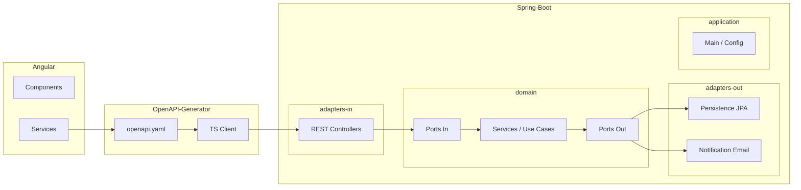

# ✈️ Tripr

> **Modern SaaS Starter** combining the power of **Spring Boot 4 (Kotlin)** and the reactivity of **Angular 21 (Signals)**.

[](https://github.com/example/tripr/actions)
[](https://kotlinlang.org/)
[](https://angular.dev/)
[](LICENSE)

Tripr is a production-ready template designed for scalability, security, and a smooth developer experience. It features a **contract-first approach** using OpenAPI to bridge the gap between a strict Hexagonal backend and a reactive Zoneless frontend.

### 🏗️ Architecture Overview


```mermaid
graph LR

  subgraph Angular
    A1[Components]
    A2[Services]
  end

  subgraph OpenAPI-Generator
    O1[openapi.yaml]
    O2[TS Client]
  end

  subgraph Spring-Boot
    subgraph adapters-in
      B1[REST Controllers]
    end
    subgraph domain
      B2[Ports In]
      B3[Services / Use Cases]
      B4[Ports Out]
    end
    subgraph adapters-out
      B5[Persistence JPA]
      B6[Notification Email]
    end
    subgraph application
      B7[Main / Config]
    end

    B1 --> B2 --> B3 --> B4
    B4 --> B5
    B4 --> B6
  end

  A2 --> O1 --> O2 --> B1
```

### 🛠️ Tech Stack

| Component    | Key Technologies                                                                     |
|:-------------|:-------------------------------------------------------------------------------------|
| **Backend**  | Kotlin, Spring Boot 4.+, Spring Security (JWT), Liquibase, MapStruct, Testcontainers |
| **Frontend** | Angular 21, Vite, Vitest, Bootstrap 5, Transloco (i18n), Signals, Zoneless           |
| **Bridge**   | **OpenAPI Generator** (Automatic Model & API Synchronization)                        |
| **DevOps**   | Docker, GitHub Actions, Ansible                                                      |

---

### 🚀 Quick Start

#### 1. Prerequisites

- **Java 25+**
- **Node.js 24+** (npm 11+)
- **Docker & Docker Compose**

#### 2. Run the project

Thanks to **Spring Boot Docker Compose** support, the PostgreSQL database is managed automatically when the backend starts.

```bash
# Terminal 1: Backend
cd backend && ./gradlew bootRun

# Terminal 2: Frontend
cd frontend && npm install && npm run dev
```

### 📁 Monorepo Structure

```text
.
├── api-spec/     # OpenAPI Specifications (API Contract)
├── backend/      # Spring Boot Kotlin API (Hexagonal Structure)
├── devops/       # Docker, Ansible & CI/CD configurations
├── e2e/          # End-to-end tests with Cypress
└── frontend/     # Angular Application (Vite & Standalone)
```

---

- 📖 [**Backend Documentation**](backend/README.md) — *Architecture, API & Tests*
- 📖 [**Frontend Documentation**](frontend/README.md) — *Modern Angular, Tooling & Vite*
