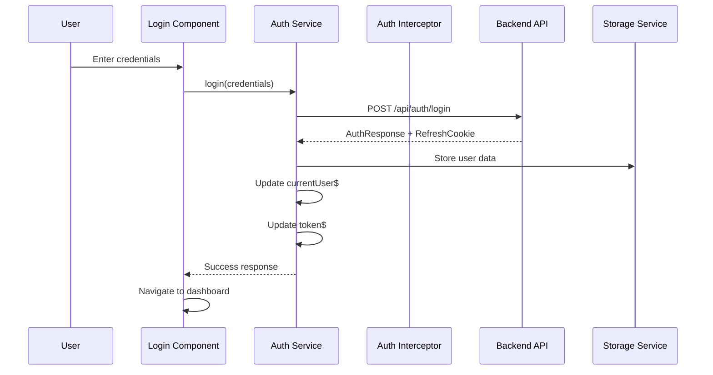
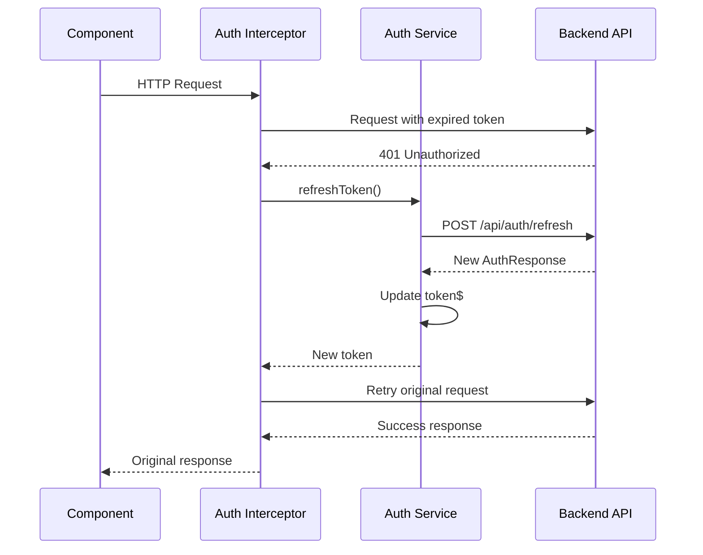

# Tripr App Frontend

[](https://github.com/vmillet-dev/tripr-app/actions)
[](https://angular.io/)
[](https://www.typescriptlang.org/)
[](https://getbootstrap.com/)

Angular 19 frontend application with JWT token management, internationalization, and responsive Bootstrap UI.

## Table of Contents

- [Technical Details](#technical-details)
- [Development Setup](#development-setup)
- [Project Structure](#project-structure)
- [Key Features](#key-features)
- [Authentication Flow](#authentication-flow)
- [Internationalization](#internationalization)
- [UI Components](#ui-components)
- [Testing](#testing)
- [Build and Deployment](#build-and-deployment)
- [Troubleshooting](#troubleshooting)

## Technical Details

### Framework
- **Angular 19.2.0** - Modern web framework with standalone components
- **TypeScript 5.7.2** - Type-safe JavaScript development with strict mode
- **Node.js 22+** - JavaScript runtime for development and build tools
- **npm/pnpm** - Package management and dependency resolution

### Authentication
**JWT and Refresh Token Handling Implementation:**
- **Access Token Storage** - Memory-based storage for security
- **Refresh Token Management** - HTTP-only cookies for automatic renewal
- **HTTP Interceptors** - Automatic token attachment and refresh handling
- **Route Guards** - Protected routes with authentication checks
- **Token Expiration Handling** - Seamless token refresh without user interruption

### State Management
**Service-Based State Management:**
- **Angular Services** - Singleton services for global state
- **RxJS Observables** - Reactive state management with BehaviorSubject
- **Local Component State** - Component-level state with Angular signals
- **Session Storage** - Persistent user preferences and UI state

### Styling
**Bootstrap 5.3.5 with Custom Theming:**
- **Responsive Grid System** - Mobile-first responsive design
- **Custom CSS Variables** - Consistent theming and brand colors
- **SCSS Preprocessing** - Advanced styling with variables and mixins
- **Component-Scoped Styles** - Encapsulated styling per component

## Development Setup

### Prerequisites

Ensure you have the following tools installed with the specified minimum versions:

| Tool | Version | Purpose | Verification |
|------|---------|---------|--------------|
| **Node.js** | 22+ | JavaScript runtime | `node --version` |
| **npm** | 10+ | Package manager | `npm --version` |
| **Angular CLI** | 19+ | Development tools | `ng version` |

### Installation

#### 1. Install Dependencies

```bash
cd frontend

# Install all dependencies
npm install

# Verify installation
npm list --depth=0
```

**Expected output:**
```
tripr-frontend@1.0.0 /path/to/frontend
├── @angular/animations@19.2.0
├── @angular/common@19.2.0
├── @angular/core@19.2.0
├── bootstrap@5.3.5
├── rxjs@7.8.0
└── typescript@5.7.2
```

#### 2. Install Angular CLI (if not installed globally)

```bash
# Install Angular CLI globally
npm install -g @angular/cli@19

# Verify installation
ng version
```

### Running the Application

#### Development Server

```bash
cd frontend

# Start development server
npm start
# or
ng serve

# Start with specific port
ng serve --port 4200

# Start with host binding (for network access)
ng serve --host 0.0.0.0
```

**Expected output:**
```
✅ Local:   http://localhost:4200/
✅ Network: http://192.168.1.100:4200/

✅ Application bundle generation complete.
✅ watch mode enabled. watching for file changes...
```

**Development Features:**
- **Hot Reload** - Automatic browser refresh on file changes
- **Source Maps** - Debug TypeScript directly in browser
- **Live Reload** - CSS changes applied without page refresh
- **Error Overlay** - Compilation errors displayed in browser

#### Production Preview

```bash
# Build for production
npm run build

# Serve production build locally
npm run serve:prod
# or
npx http-server dist/tripr-frontend -p 4200
```

### Build Process

#### Development Build

```bash
# Development build with source maps
ng build --configuration development

# Watch mode for continuous building
ng build --watch
```

#### Production Build

```bash
# Optimized production build
npm run build
# or
ng build --configuration production

# Build with bundle analysis
ng build --stats-json
npx webpack-bundle-analyzer dist/tripr-frontend/stats.json
```

**Production Build Features:**
- **Tree Shaking** - Remove unused code
- **Minification** - Compressed JavaScript and CSS
- **AOT Compilation** - Ahead-of-time template compilation
- **Bundle Splitting** - Separate vendor and application bundles
- **Service Worker** - Offline support and caching

**Build Output:**
```
dist/tripr-frontend/
├── index.html              # Main HTML file
├── main.[hash].js          # Application bundle
├── vendor.[hash].js        # Third-party dependencies
├── runtime.[hash].js       # Angular runtime
├── styles.[hash].css       # Compiled styles
└── assets/                 # Static assets
```

## Project Structure

### Component Architecture

The frontend follows Angular's recommended architecture with standalone components:

```
src/
├── app/
│   ├── core/                           # Core singleton services and guards
│   │   ├── components/                 # Shared UI components
│   │   │   ├── header/                 # Navigation header
│   │   │   ├── footer/                 # Application footer
│   │   │   └── loading-spinner/        # Loading indicator
│   │   ├── guards/                     # Route protection
│   │   │   ├── auth.guard.ts           # Authentication guard
│   │   │   └── no-auth.guard.ts        # Redirect authenticated users
│   │   ├── interceptors/               # HTTP request/response handling
│   │   │   ├── auth.interceptor.ts     # JWT token attachment
│   │   │   ├── error.interceptor.ts    # Global error handling
│   │   │   └── loading.interceptor.ts  # Loading state management
│   │   ├── models/                     # TypeScript interfaces and types
│   │   │   ├── auth.model.ts           # Authentication models
│   │   │   ├── user.model.ts           # User data models
│   │   │   └── api.model.ts            # API response models
│   │   └── services/                   # Core business services
│   │       ├── auth.service.ts         # Authentication logic
│   │       ├── user.service.ts         # User management
│   │       ├── api.service.ts          # HTTP API client
│   │       └── storage.service.ts      # Local/session storage
│   ├── features/                       # Feature-based modules
│   │   ├── auth/                       # Authentication features
│   │   │   ├── components/             # Auth-specific components
│   │   │   │   ├── login/              # Login form component
│   │   │   │   ├── register/           # Registration form
│   │   │   │   ├── forgot-password/    # Password reset request
│   │   │   │   └── reset-password/     # Password reset form
│   │   │   ├── services/               # Auth feature services
│   │   │   └── auth.routes.ts          # Auth routing configuration
│   │   ├── dashboard/                  # User dashboard
│   │   │   ├── components/             # Dashboard components
│   │   │   │   ├── dashboard-home/     # Main dashboard view
│   │   │   │   ├── profile/            # User profile management
│   │   │   │   └── settings/           # User settings
│   │   │   └── dashboard.routes.ts     # Dashboard routing
│   │   └── home/                       # Public home page
│   │       ├── components/             # Home page components
│   │       └── home.routes.ts          # Home routing
│   ├── shared/                         # Shared utilities and components
│   │   ├── components/                 # Reusable UI components
│   │   │   ├── form-field/             # Custom form controls
│   │   │   ├── modal/                  # Modal dialog component
│   │   │   └── toast/                  # Notification toasts
│   │   ├── directives/                 # Custom directives
│   │   ├── pipes/                      # Custom pipes
│   │   └── validators/                 # Form validators
│   ├── transloco/                      # Internationalization
│   │   ├── transloco-root.module.ts    # Transloco configuration
│   │   └── transloco.config.ts         # Translation settings
│   ├── app.component.ts                # Root application component
│   ├── app.config.ts                   # Application configuration
│   └── app.routes.ts                   # Main routing configuration
├── assets/                             # Static assets
│   ├── i18n/                           # Translation files
│   │   ├── en.json                     # English translations
│   │   └── fr.json                     # French translations
│   ├── images/                         # Image assets
│   └── icons/                          # Icon assets
├── environments/                       # Environment configurations
│   ├── environment.ts                  # Development environment
│   ├── environment.prod.ts             # Production environment
│   └── environment.staging.ts          # Staging environment
├── styles/                             # Global styles
│   ├── _variables.scss                 # SCSS variables
│   ├── _mixins.scss                    # SCSS mixins
│   └── styles.scss                     # Main stylesheet
├── index.html                          # Main HTML template
├── main.ts                             # Application bootstrap
└── polyfills.ts                        # Browser compatibility
```

### Service Organization

**Core Services Architecture:**

#### Authentication Service
```typescript
@Injectable({
  providedIn: 'root'
})
export class AuthService {
  private currentUserSubject = new BehaviorSubject<User | null>(null);
  public currentUser$ = this.currentUserSubject.asObservable();
  
  private tokenSubject = new BehaviorSubject<string | null>(null);
  public token$ = this.tokenSubject.asObservable();
  
  constructor(
    private http: HttpClient,
    private router: Router,
    private storageService: StorageService
  ) {
    this.initializeAuth();
  }
  
  login(credentials: LoginRequest): Observable<AuthResponse> {
    return this.http.post<AuthResponse>('/api/auth/login', credentials)
      .pipe(
        tap(response => this.handleAuthSuccess(response)),
        catchError(error => this.handleAuthError(error))
      );
  }
  
  private handleAuthSuccess(response: AuthResponse): void {
    this.tokenSubject.next(response.accessToken);
    this.currentUserSubject.next(response.user);
    this.storageService.setItem('user', response.user);
  }
}
```

#### HTTP Interceptor Service
```typescript
@Injectable()
export class AuthInterceptor implements HttpInterceptor {
  constructor(private authService: AuthService) {}
  
  intercept(req: HttpRequest<any>, next: HttpHandler): Observable<HttpEvent<any>> {
    return this.authService.token$.pipe(
      take(1),
      switchMap(token => {
        if (token && !this.isAuthEndpoint(req.url)) {
          req = req.clone({
            setHeaders: {
              Authorization: `Bearer ${token}`
            }
          });
        }
        
        return next.handle(req).pipe(
          catchError(error => {
            if (error.status === 401) {
              return this.handle401Error(req, next);
            }
            return throwError(error);
          })
        );
      })
    );
  }
  
  private handle401Error(req: HttpRequest<any>, next: HttpHandler): Observable<HttpEvent<any>> {
    return this.authService.refreshToken().pipe(
      switchMap(() => next.handle(this.addToken(req))),
      catchError(() => {
        this.authService.logout();
        return throwError('Token refresh failed');
      })
    );
  }
}
```

### Routing Setup

**Main Routing Configuration:**
```typescript
// app.routes.ts
export const routes: Routes = [
  {
    path: '',
    component: HomeComponent
  },
  {
    path: 'auth',
    loadChildren: () => import('./features/auth/auth.routes').then(m => m.AUTH_ROUTES),
    canActivate: [NoAuthGuard]
  },
  {
    path: 'dashboard',
    loadChildren: () => import('./features/dashboard/dashboard.routes').then(m => m.DASHBOARD_ROUTES),
    canActivate: [AuthGuard]
  },
  {
    path: '**',
    redirectTo: ''
  }
];
```

**Feature Routing (Auth):**
```typescript
// features/auth/auth.routes.ts
export const AUTH_ROUTES: Routes = [
  {
    path: 'login',
    component: LoginComponent,
    title: 'Login - Tripr App'
  },
  {
    path: 'register',
    component: RegisterComponent,
    title: 'Register - Tripr App'
  },
  {
    path: 'forgot-password',
    component: ForgotPasswordComponent,
    title: 'Forgot Password - Tripr App'
  },
  {
    path: 'reset-password',
    component: ResetPasswordComponent,
    title: 'Reset Password - Tripr App'
  }
];
```

### Authentication Flow

The frontend implements a comprehensive authentication flow with JWT tokens and refresh token handling:

#### Login Flow



#### Token Refresh Flow



#### Authentication Components

**Login Component:**
```typescript
@Component({
  selector: 'app-login',
  standalone: true,
  imports: [CommonModule, ReactiveFormsModule, TranslocoModule],
  template: `
    <div class="login-container">
      <form [formGroup]="loginForm" (ngSubmit)="onSubmit()">
        <div class="mb-3">
          <label for="email" class="form-label">{{ 'auth.email' | transloco }}</label>
          <input
            type="email"
            class="form-control"
            id="email"
            formControlName="email"
            [class.is-invalid]="isFieldInvalid('email')"
          >
          <div class="invalid-feedback" *ngIf="isFieldInvalid('email')">
            {{ getFieldError('email') | transloco }}
          </div>
        </div>
        
        <div class="mb-3">
          <label for="password" class="form-label">{{ 'auth.password' | transloco }}</label>
          <input
            type="password"
            class="form-control"
            id="password"
            formControlName="password"
            [class.is-invalid]="isFieldInvalid('password')"
          >
          <div class="invalid-feedback" *ngIf="isFieldInvalid('password')">
            {{ getFieldError('password') | transloco }}
          </div>
        </div>
        
        <button
          type="submit"
          class="btn btn-primary w-100"
          [disabled]="loginForm.invalid || isLoading"
        >
          <span *ngIf="isLoading" class="spinner-border spinner-border-sm me-2"></span>
          {{ 'auth.login' | transloco }}
        </button>
      </form>
    </div>
  `
})
export class LoginComponent {
  loginForm = this.fb.group({
    email: ['', [Validators.required, Validators.email]],
    password: ['', [Validators.required, Validators.minLength(8)]]
  });
  
  isLoading = false;
  
  constructor(
    private fb: FormBuilder,
    private authService: AuthService,
    private router: Router,
    private toastService: ToastService
  ) {}
  
  onSubmit(): void {
    if (this.loginForm.valid) {
      this.isLoading = true;
      
      this.authService.login(this.loginForm.value as LoginRequest)
        .subscribe({
          next: () => {
            this.router.navigate(['/dashboard']);
            this.toastService.showSuccess('Login successful');
          },
          error: (error) => {
            this.toastService.showError(error.message || 'Login failed');
            this.isLoading = false;
          }
        });
    }
  }
}
```

## Key Features

### JWT Token Management

**Token Storage Strategy:**
- **Access Tokens** - Stored in memory (service variables) for security
- **Refresh Tokens** - HTTP-only cookies managed by backend
- **User Data** - Session storage for persistence across browser tabs

**Token Management Service:**
```typescript
@Injectable({
  providedIn: 'root'
})
export class TokenService {
  private readonly TOKEN_KEY = 'access_token';
  private tokenSubject = new BehaviorSubject<string | null>(null);
  
  get token$(): Observable<string | null> {
    return this.tokenSubject.asObservable();
  }
  
  get token(): string | null {
    return this.tokenSubject.value;
  }
  
  setToken(token: string): void {
    this.tokenSubject.next(token);
    // Don't store in localStorage for security
  }
  
  clearToken(): void {
    this.tokenSubject.next(null);
  }
  
  isTokenExpired(token: string): boolean {
    try {
      const payload = JSON.parse(atob(token.split('.')[1]));
      return payload.exp * 1000 < Date.now();
    } catch {
      return true;
    }
  }
}
```

### HTTP Interceptors

**Authentication Interceptor:**
```typescript
@Injectable()
export class AuthInterceptor implements HttpInterceptor {
  constructor(
    private tokenService: TokenService,
    private authService: AuthService
  ) {}
  
  intercept(req: HttpRequest<any>, next: HttpHandler): Observable<HttpEvent<any>> {
    // Skip auth for public endpoints
    if (this.isPublicEndpoint(req.url)) {
      return next.handle(req);
    }
    
    const token = this.tokenService.token;
    
    if (token && !this.tokenService.isTokenExpired(token)) {
      req = this.addTokenToRequest(req, token);
    }
    
    return next.handle(req).pipe(
      catchError(error => {
        if (error.status === 401 && !this.isRefreshRequest(req)) {
          return this.handleUnauthorized(req, next);
        }
        return throwError(error);
      })
    );
  }
  
  private handleUnauthorized(req: HttpRequest<any>, next: HttpHandler): Observable<HttpEvent<any>> {
    return this.authService.refreshToken().pipe(
      switchMap(response => {
        this.tokenService.setToken(response.accessToken);
        return next.handle(this.addTokenToRequest(req, response.accessToken));
      }),
      catchError(() => {
        this.authService.logout();
        return throwError('Authentication failed');
      })
    );
  }
}
```

**Error Interceptor:**
```typescript
@Injectable()
export class ErrorInterceptor implements HttpInterceptor {
  constructor(private toastService: ToastService) {}
  
  intercept(req: HttpRequest<any>, next: HttpHandler): Observable<HttpEvent<any>> {
    return next.handle(req).pipe(
      catchError((error: HttpErrorResponse) => {
        let errorMessage = 'An unexpected error occurred';
        
        if (error.error instanceof ErrorEvent) {
          // Client-side error
          errorMessage = error.error.message;
        } else {
          // Server-side error
          switch (error.status) {
            case 400:
              errorMessage = 'Bad request. Please check your input.';
              break;
            case 401:
              errorMessage = 'Unauthorized. Please log in again.';
              break;
            case 403:
              errorMessage = 'Forbidden. You do not have permission.';
              break;
            case 404:
              errorMessage = 'Resource not found.';
              break;
            case 500:
              errorMessage = 'Internal server error. Please try again later.';
              break;
            default:
              errorMessage = error.error?.message || errorMessage;
          }
        }
        
        this.toastService.showError(errorMessage);
        return throwError(error);
      })
    );
  }
}
```

### Error Handling

**Global Error Handler:**
```typescript
@Injectable()
export class GlobalErrorHandler implements ErrorHandler {
  constructor(private toastService: ToastService) {}
  
  handleError(error: any): void {
    console.error('Global error:', error);
    
    if (error instanceof HttpErrorResponse) {
      // HTTP errors are handled by ErrorInterceptor
      return;
    }
    
    // Handle client-side errors
    const message = error?.message || 'An unexpected error occurred';
    this.toastService.showError(message);
  }
}
```

### UI Components and Design System

**Bootstrap Integration:**
```scss
// styles/_variables.scss
$primary: #007bff;
$secondary: #6c757d;
$success: #28a745;
$danger: #dc3545;
$warning: #ffc107;
$info: #17a2b8;

$font-family-sans-serif: 'Inter', -apple-system, BlinkMacSystemFont, 'Segoe UI', Roboto, sans-serif;
$font-size-base: 1rem;
$line-height-base: 1.5;

$border-radius: 0.375rem;
$border-radius-sm: 0.25rem;
$border-radius-lg: 0.5rem;

$box-shadow: 0 0.125rem 0.25rem rgba(0, 0, 0, 0.075);
$box-shadow-sm: 0 0.125rem 0.25rem rgba(0, 0, 0, 0.075);
$box-shadow-lg: 0 1rem 3rem rgba(0, 0, 0, 0.175);
```

**Custom Components:**

**Toast Notification Component:**
```typescript
@Component({
  selector: 'app-toast',
  standalone: true,
  imports: [CommonModule],
  template: `
    <div class="toast-container position-fixed top-0 end-0 p-3">
      <div
        *ngFor="let toast of toasts"
        class="toast show"
        [class]="'toast-' + toast.type"
        role="alert"
      >
        <div class="toast-header">
          <strong class="me-auto">{{ toast.title }}</strong>
          <button
            type="button"
            class="btn-close"
            (click)="removeToast(toast.id)"
          ></button>
        </div>
        <div class="toast-body">
          {{ toast.message }}
        </div>
      </div>
    </div>
  `
})
export class ToastComponent implements OnInit {
  toasts: Toast[] = [];
  
  constructor(private toastService: ToastService) {}
  
  ngOnInit(): void {
    this.toastService.toasts$.subscribe(toasts => {
      this.toasts = toasts;
    });
  }
  
  removeToast(id: string): void {
    this.toastService.removeToast(id);
  }
}
```

## Internationalization

### Transloco Configuration

**Setup and Configuration:**
```typescript
// transloco/transloco.config.ts
export const translocoConfig: TranslocoConfig = {
  availableLangs: ['en', 'fr'],
  defaultLang: 'en',
  fallbackLang: 'en',
  prodMode: environment.production,
  reRenderOnLangChange: true,
  missingHandler: {
    useFallbackTranslation: true,
    allowEmpty: false,
    logMissingKey: !environment.production
  }
};
```

**Translation Files:**

**English (assets/i18n/en.json):**
```json
{
  "common": {
    "save": "Save",
    "cancel": "Cancel",
    "delete": "Delete",
    "edit": "Edit",
    "loading": "Loading...",
    "error": "Error",
    "success": "Success"
  },
  "auth": {
    "login": "Login",
    "register": "Register",
    "logout": "Logout",
    "email": "Email",
    "password": "Password",
    "confirmPassword": "Confirm Password",
    "firstName": "First Name",
    "lastName": "Last Name",
    "forgotPassword": "Forgot Password?",
    "resetPassword": "Reset Password",
    "loginSuccess": "Login successful",
    "registrationSuccess": "Registration successful",
    "invalidCredentials": "Invalid email or password"
  },
  "dashboard": {
    "welcome": "Welcome, {{name}}!",
    "profile": "Profile",
    "settings": "Settings",
    "logout": "Logout"
  }
}
```

**French (assets/i18n/fr.json):**
```json
{
  "common": {
    "save": "Enregistrer",
    "cancel": "Annuler",
    "delete": "Supprimer",
    "edit": "Modifier",
    "loading": "Chargement...",
    "error": "Erreur",
    "success": "Succès"
  },
  "auth": {
    "login": "Connexion",
    "register": "S'inscrire",
    "logout": "Déconnexion",
    "email": "Email",
    "password": "Mot de passe",
    "confirmPassword": "Confirmer le mot de passe",
    "firstName": "Prénom",
    "lastName": "Nom",
    "forgotPassword": "Mot de passe oublié ?",
    "resetPassword": "Réinitialiser le mot de passe",
    "loginSuccess": "Connexion réussie",
    "registrationSuccess": "Inscription réussie",
    "invalidCredentials": "Email ou mot de passe invalide"
  },
  "dashboard": {
    "welcome": "Bienvenue, {{name}} !",
    "profile": "Profil",
    "settings": "Paramètres",
    "logout": "Déconnexion"
  }
}
```

**Language Switching Service:**
```typescript
@Injectable({
  providedIn: 'root'
})
export class LanguageService {
  private readonly LANGUAGE_KEY = 'selected_language';
  
  constructor(private translocoService: TranslocoService) {
    this.initializeLanguage();
  }
  
  private initializeLanguage(): void {
    const savedLanguage = localStorage.getItem(this.LANGUAGE_KEY);
    const browserLanguage = navigator.language.split('-')[0];
    const defaultLanguage = savedLanguage || browserLanguage || 'en';
    
    this.setLanguage(defaultLanguage);
  }
  
  setLanguage(language: string): void {
    this.translocoService.setActiveLang(language);
    localStorage.setItem(this.LANGUAGE_KEY, language);
    document.documentElement.lang = language;
  }
  
  getCurrentLanguage(): string {
    return this.translocoService.getActiveLang();
  }
  
  getAvailableLanguages(): string[] {
    return this.translocoService.getAvailableLangs() as string[];
  }
}
```

## Testing

### Unit Testing Setup

**Jest Configuration:**
```typescript
// jest.config.js
module.exports = {
  preset: 'jest-preset-angular',
  setupFilesAfterEnv: ['<rootDir>/src/setup-jest.ts'],
  testMatch: ['**/+(*.)+(spec).+(ts)'],
  collectCoverageFrom: [
    'src/app/**/*.ts',
    '!src/app/**/*.module.ts',
    '!src/app/**/*.interface.ts',
    '!src/app/**/*.model.ts'
  ],
  coverageReporters: ['html', 'text-summary', 'lcov'],
  coverageThreshold: {
    global: {
      branches: 80,
      functions: 80,
      lines: 80,
      statements: 80
    }
  }
};
```

**Component Testing:**
```typescript
describe('LoginComponent', () => {
  let component: LoginComponent;
  let fixture: ComponentFixture<LoginComponent>;
  let authService: jest.Mocked<AuthService>;
  let router: jest.Mocked<Router>;
  
  beforeEach(async () => {
    const authServiceMock = {
      login: jest.fn(),
      currentUser$: of(null)
    };
    
    const routerMock = {
      navigate: jest.fn()
    };
    
    await TestBed.configureTestingModule({
      imports: [LoginComponent, ReactiveFormsModule, TranslocoTestingModule],
      providers: [
        { provide: AuthService, useValue: authServiceMock },
        { provide: Router, useValue: routerMock }
      ]
    }).compileComponents();
    
    fixture = TestBed.createComponent(LoginComponent);
    component = fixture.componentInstance;
    authService = TestBed.inject(AuthService) as jest.Mocked<AuthService>;
    router = TestBed.inject(Router) as jest.Mocked<Router>;
  });
  
  it('should create', () => {
    expect(component).toBeTruthy();
  });
  
  it('should validate email format', () => {
    const emailControl = component.loginForm.get('email');
    
    emailControl?.setValue('invalid-email');
    expect(emailControl?.hasError('email')).toBeTruthy();
    
    emailControl?.setValue('valid@example.com');
    expect(emailControl?.hasError('email')).toBeFalsy();
  });
  
  it('should call authService.login on form submit', () => {
    const loginData = {
      email: 'test@example.com',
      password: 'password123'
    };
    
    authService.login.mockReturnValue(of({ user: mockUser, accessToken: 'token' }));
    
    component.loginForm.patchValue(loginData);
    component.onSubmit();
    
    expect(authService.login).toHaveBeenCalledWith(loginData);
    expect(router.navigate).toHaveBeenCalledWith(['/dashboard']);
  });
});
```

**Service Testing:**
```typescript
describe('AuthService', () => {
  let service: AuthService;
  let httpMock: HttpTestingController;
  
  beforeEach(() => {
    TestBed.configureTestingModule({
      imports: [HttpClientTestingModule],
      providers: [AuthService]
    });
    
    service = TestBed.inject(AuthService);
    httpMock = TestBed.inject(HttpTestingController);
  });
  
  afterEach(() => {
    httpMock.verify();
  });
  
  it('should login user successfully', () => {
    const mockResponse: AuthResponse = {
      user: mockUser,
      accessToken: 'mock-token'
    };
    
    service.login({ email: 'test@example.com', password: 'password' })
      .subscribe(response => {
        expect(response).toEqual(mockResponse);
      });
    
    const req = httpMock.expectOne('/api/auth/login');
    expect(req.request.method).toBe('POST');
    req.flush(mockResponse);
  });
  
  it('should handle login error', () => {
    service.login({ email: 'test@example.com', password: 'wrong' })
      .subscribe({
        next: () => fail('Should have failed'),
        error: (error) => {
          expect(error.status).toBe(401);
        }
      });
    
    const req = httpMock.expectOne('/api/auth/login');
    req.flush({ message: 'Invalid credentials' }, { status: 401, statusText: 'Unauthorized' });
  });
});
```

### Running Tests

```bash
# Run all unit tests
npm test
# or
ng test

# Run tests with coverage
npm run test:coverage
# or
ng test --code-coverage

# Run tests in watch mode
npm run test:watch

# Run tests once (CI mode)
npm run test:ci
# or
ng test --watch=false --browsers=ChromeHeadless
```

### E2E Testing Integration

**Cypress Integration:**
```typescript
// cypress/support/commands.ts
declare global {
  namespace Cypress {
    interface Chainable {
      login(email: string, password: string): Chainable<void>;
      logout(): Chainable<void>;
    }
  }
}

Cypress.Commands.add('login', (email: string, password: string) => {
  cy.visit('/auth/login');
  cy.get('[data-cy=email-input]').type(email);
  cy.get('[data-cy=password-input]').type(password);
  cy.get('[data-cy=login-button]').click();
  cy.url().should('include', '/dashboard');
});

Cypress.Commands.add('logout', () => {
  cy.get('[data-cy=user-menu]').click();
  cy.get('[data-cy=logout-button]').click();
  cy.url().should('eq', Cypress.config().baseUrl + '/');
});
```

## Build and Deployment

### Build Configurations

**Environment Files:**
```typescript
// environments/environment.ts (development)
export const environment = {
  production: false,
  apiUrl: 'http://localhost:8081/api',
  baseUrl: 'http://localhost:4200',
  enableDebugTools: true,
  logLevel: 'debug'
};

// environments/environment.prod.ts (production)
export const environment = {
  production: true,
  apiUrl: '/api',
  baseUrl: '',
  enableDebugTools: false,
  logLevel: 'error'
};
```

**Angular Configuration:**
```json
{
  "projects": {
    "tripr-frontend": {
      "architect": {
        "build": {
          "builder": "@angular-devkit/build-angular:browser",
          "options": {
            "outputPath": "dist/tripr-frontend",
            "index": "src/index.html",
            "main": "src/main.ts",
            "polyfills": "src/polyfills.ts",
            "tsConfig": "tsconfig.app.json",
            "assets": ["src/favicon.ico", "src/assets"],
            "styles": ["src/styles.scss"],
            "scripts": []
          },
          "configurations": {
            "production": {
              "budgets": [
                {
                  "type": "initial",
                  "maximumWarning": "2mb",
                  "maximumError": "5mb"
                }
              ],
              "fileReplacements": [
                {
                  "replace": "src/environments/environment.ts",
                  "with": "src/environments/environment.prod.ts"
                }
              ],
              "outputHashing": "all",
              "sourceMap": false,
              "namedChunks": false,
              "extractLicenses": true,
              "vendorChunk": false,
              "buildOptimizer": true
            }
          }
        }
      }
    }
  }
}
```

### Docker Integration

**Dockerfile for Frontend:**
```dockerfile
# Multi-stage build for Angular application
FROM node:22-alpine AS builder

WORKDIR /app

# Copy package files
COPY package*.json ./
RUN npm ci --only=production

# Copy source code
COPY . .

# Build application
RUN npm run build

# Production stage
FROM nginx:alpine

# Copy built application
COPY --from=builder /app/dist/tripr-frontend /usr/share/nginx/html

# Copy nginx configuration
COPY nginx.conf /etc/nginx/nginx.conf

EXPOSE 80

CMD ["nginx", "-g", "daemon off;"]
```

**Nginx Configuration:**
```nginx
server {
    listen 80;
    server_name localhost;
    root /usr/share/nginx/html;
    index index.html;

    # Handle Angular routing
    location / {
        try_files $uri $uri/ /index.html;
    }

    # API proxy (if needed)
    location /api {
        proxy_pass http://backend:8081;
        proxy_set_header Host $host;
        proxy_set_header X-Real-IP $remote_addr;
    }

    # Security headers
    add_header X-Frame-Options "SAMEORIGIN" always;
    add_header X-Content-Type-Options "nosniff" always;
    add_header X-XSS-Protection "1; mode=block" always;

    # Gzip compression
    gzip on;
    gzip_types text/plain text/css application/json application/javascript text/xml application/xml application/xml+rss text/javascript;
}
```

## Troubleshooting

### Common Setup Issues

#### Node.js/npm Issues

**Problem**: Dependencies fail to install

**Solution**:
```bash
# Clear npm cache
npm cache clean --force

# Delete node_modules and package-lock.json
rm -rf node_modules package-lock.json

# Reinstall dependencies
npm install

# Use specific Node.js version
nvm use 22
npm install
```

#### Angular CLI Issues

**Problem**: Angular CLI commands fail

**Solution**:
```bash
# Install Angular CLI globally
npm install -g @angular/cli@19

# Clear Angular CLI cache
ng cache clean

# Verify installation
ng version
```

#### Build Errors

**Problem**: TypeScript compilation errors

**Solution**:
```bash
# Check TypeScript configuration
npx tsc --noEmit

# Update TypeScript
npm update typescript

# Clear Angular build cache
rm -rf .angular/cache
ng build
```

#### Development Server Issues

**Problem**: Development server fails to start

**Solution**:
```bash
# Check if port is in use
lsof -i :4200

# Use different port
ng serve --port 4201

# Clear browser cache and restart
ng serve --disable-host-check
```

### Performance Issues

#### Slow Build Times

**Problem**: Build takes too long

**Solution**:
```bash
# Increase Node.js memory limit
export NODE_OPTIONS="--max-old-space-size=8192"

# Use development build
ng build --configuration development

# Enable build cache
ng build --build-cache
```

#### Runtime Performance

**Problem**: Application runs slowly

**Solution**:
```typescript
// Enable OnPush change detection
@Component({
  changeDetection: ChangeDetectionStrategy.OnPush
})

// Use trackBy functions in *ngFor
trackByFn(index: number, item: any): any {
  return item.id;
}

// Lazy load modules
const routes: Routes = [
  {
    path: 'feature',
    loadChildren: () => import('./feature/feature.module').then(m => m.FeatureModule)
  }
];
```

### Authentication Issues

#### Token Management Problems

**Problem**: Tokens not being attached to requests

**Solution**:
```typescript
// Verify interceptor is registered
export const appConfig: ApplicationConfig = {
  providers: [
    provideHttpClient(
      withInterceptors([authInterceptor, errorInterceptor])
    )
  ]
};

// Check token service
console.log('Current token:', this.tokenService.token);
```

#### CORS Issues

**Problem**: Cross-origin requests blocked

**Solution**:
```typescript
// Update environment configuration
export const environment = {
  apiUrl: 'http://localhost:8081/api', // Ensure correct URL
  production: false
};

// Check backend CORS configuration
// Backend should allow http://localhost:4200
```

### Getting Help

**Development Resources:**
- [Angular Documentation](https://angular.io/docs)
- [TypeScript Documentation](https://www.typescriptlang.org/docs/)
- [Bootstrap Documentation](https://getbootstrap.com/docs/)
- [RxJS Documentation](https://rxjs.dev/)

**Community Support:**
- [Angular GitHub Issues](https://github.com/angular/angular/issues)
- [Stack Overflow](https://stackoverflow.com/questions/tagged/angular)
- [Angular Discord](https://discord.gg/angular)

---

**Built with ❤️ using Angular and TypeScript. Happy coding! 🚀**
